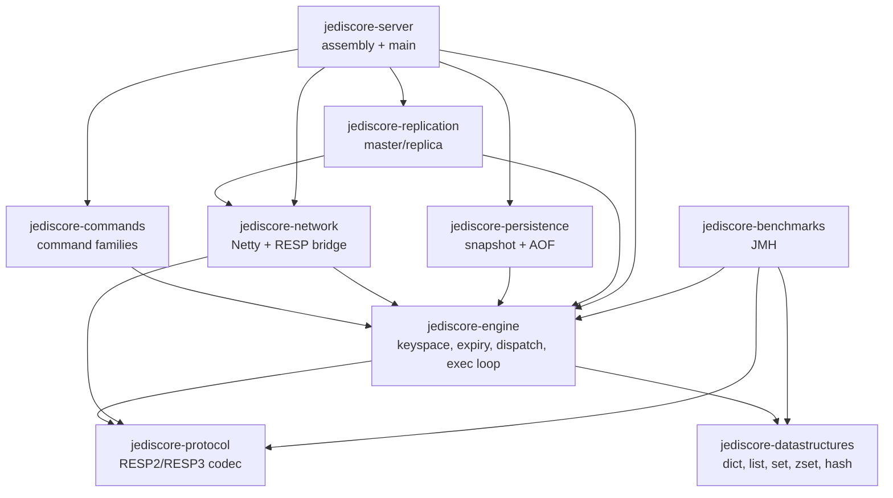

# JediCore Architecture

This document is the living architectural record for JediCore. It is updated every
phase. Each phase appends to the changelog at the bottom.

## Goals and non-goals

**Goals**
- Wire-compatible with Redis (RESP2/RESP3); `redis-cli`, Jedis and Lettuce work unmodified.
- Clean separation of concerns across network, protocol, dispatch, data structures,
  persistence, and replication.
- A correct, explicitly stated and defended concurrency model.
- Performance as a first-class concern: minimal hot-path allocation, pooled buffers,
  primitive collections where they matter.

**Non-goals (for now)**
- Redis Cluster sharding/gossip (the engine is *designed* for sharding but ships single-shard).
- 100% command coverage on day one — commands land family by family (see `COMPATIBILITY.md`).

## Module graph

Modules are decoupled and the dependency graph is acyclic. `protocol` and
`datastructures` are dependency-free leaves; `server` is the only assembly point.

## Concurrency model (the central design decision)

> **Netty I/O threads → a single-writer command-execution loop per shard → virtual
> threads for blocking/background work.**

- **Netty event-loop threads** own sockets and perform RESP framing/parsing, producing
  immutable command objects. They never touch the keyspace.
- **The command thread** is a single thread that executes commands for a given keyspace
  shard. Because exactly one thread mutates a shard, the data structures need **no
  internal locking**, and we get Redis's exact atomicity guarantee: each command is
  atomic, and `MULTI`/`EXEC` is trivially atomic. This is the same bet Redis makes, and
  it is why Redis saturates a NIC on one core — no lock contention, cache-friendly access.
- **Designed for N shards, shipped with 1.** The keyspace is addressable by shard.
  v1 runs a single shard (true Redis semantics, including trivially-correct multi-key
  commands). Multi-shard partitioning by key hash is deliberately deferred until there
  is a correct cross-shard story, because partial sharding silently breaks multi-key
  atomicity.
- **Virtual threads (Java 21)** handle work that must not block the command thread:
  blocking commands (`BLPOP`/`BRPOP`/`WAIT`) modeled as parked clients re-dispatched on
  key-ready events, background persistence flushing, and replication streaming.

**Defense of the trade-off.** A fully multi-threaded engine could use more cores, but a
single-writer loop buys correctness, predictable tail latency, and a vastly simpler
mental model — and Redis itself proves single-threaded execution is enough to be fast.
We keep the door open to sharding without paying its complexity prematurely.

### The fork() problem (persistence, Phase 5 — flagged early, honestly)

Real Redis snapshots by calling `fork()`, getting a copy-on-write view of memory for
free from the OS. **The JVM cannot `fork()`** a copy-on-write child. We will design a
correct alternative (a consistent point-in-time capture driven on the command thread,
e.g. copy-on-write at the data-structure level or a serialized snapshot iterator) and
document its memory/latency trade-offs rather than pretend the fork model exists.

## Build and tooling

- **Gradle (Kotlin DSL)**, multi-module. Shared configuration lives in a single
  convention plugin (`buildSrc/.../jediscore.java-conventions.gradle.kts`).
- **Version catalog** (`gradle/libs.versions.toml`) is the single source of dependency
  and plugin versions, imported into `buildSrc` so build logic never drifts from it.
- **Java 21 toolchain** is pinned in the convention plugin; the Foojay resolver
  auto-provisions it where absent.
- **CI** (GitHub Actions) builds, runs all tests, and runs a JMH smoke benchmark, with
  Gradle caching.

## Changelog

### Phase 0 — repository, build tooling, CI
- Stood up the 9-module Gradle build with the dependency graph above (modules are
  near-empty placeholders that compile, test, and benchmark green).
- Pinned the Java 21 toolchain; wired SLF4J/Logback, Micrometer, Netty, JUnit 5,
  AssertJ, Testcontainers, and JMH.
- Runnable `jediscore-server` main that prints a banner and exits cleanly (no networking).
- One passing unit test per module; one runnable JMH benchmark (`Fnv1a` hash).
- GitHub Actions CI: build + test + benchmark smoke, Gradle cache enabled.
- Established this document and `COMPATIBILITY.md` as living docs.
