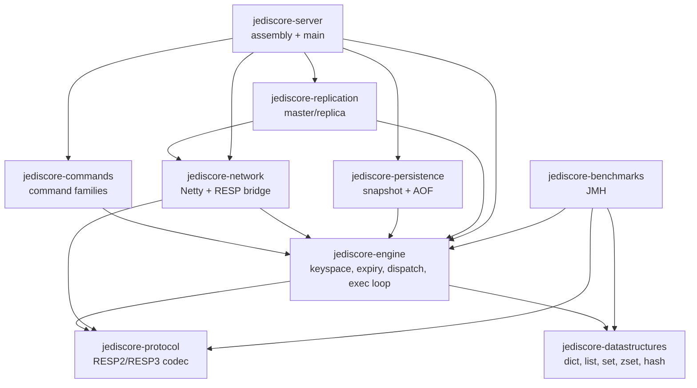
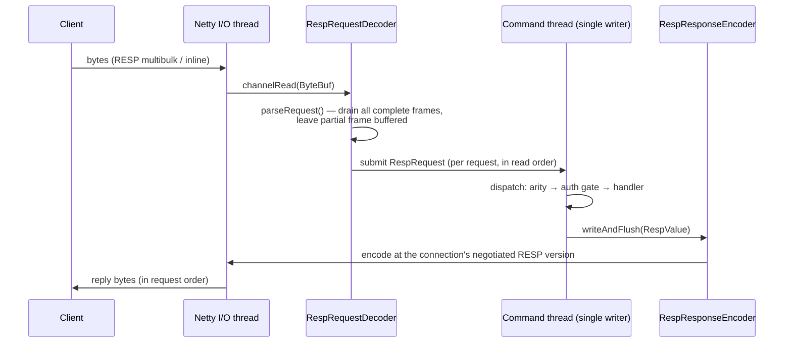
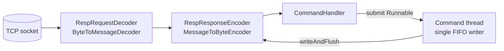
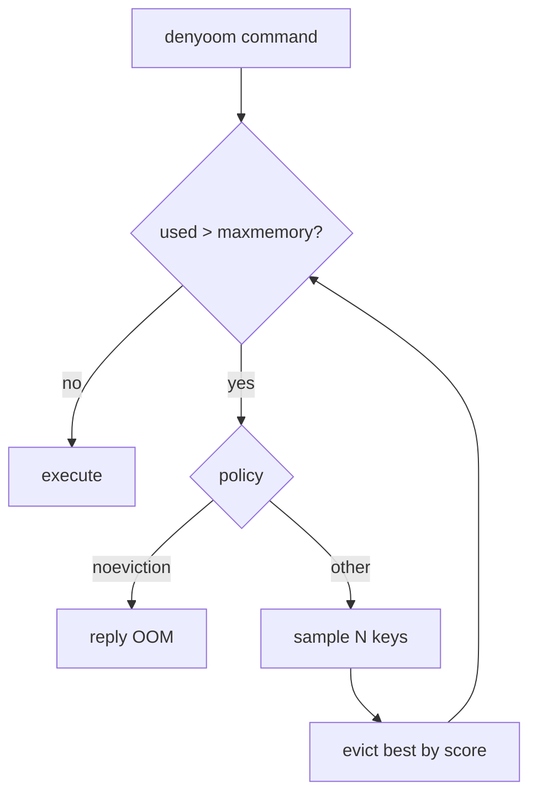

# JediCore Architecture

This document is the living architectural record for JediCore. It is updated every
phase. Each phase appends to the changelog at the bottom.

## Goals and non-goals

**Goals**
- Wire-compatible with Redis (RESP2/RESP3); `redis-cli`, Jedis and Lettuce work unmodified.
- Clean separation of concerns across network, protocol, dispatch, data structures,
  persistence, and replication.
- A correct, explicitly stated and defended concurrency model.
- Performance as a first-class concern: minimal hot-path allocation, pooled buffers,
  primitive collections where they matter.

**Non-goals (for now)**
- Redis Cluster sharding/gossip (the engine is *designed* for sharding but ships single-shard).
- 100% command coverage on day one — commands land family by family (see `COMPATIBILITY.md`).

## Module graph

Modules are decoupled and the dependency graph is acyclic. `protocol` and
`datastructures` are dependency-free leaves; `server` is the only assembly point.



## Concurrency model (the central design decision)

> **Netty I/O threads → a single-writer command-execution loop per shard → virtual
> threads for blocking/background work.**

- **Netty event-loop threads** own sockets and perform RESP framing/parsing, producing
  immutable command objects. They never touch the keyspace.
- **The command thread** is a single thread that executes commands for a given keyspace
  shard. Because exactly one thread mutates a shard, the data structures need **no
  internal locking**, and we get Redis's exact atomicity guarantee: each command is
  atomic, and `MULTI`/`EXEC` is trivially atomic. This is the same bet Redis makes, and
  it is why Redis saturates a NIC on one core — no lock contention, cache-friendly access.
- **Designed for N shards, shipped with 1.** The keyspace is addressable by shard.
  v1 runs a single shard (true Redis semantics, including trivially-correct multi-key
  commands). Multi-shard partitioning by key hash is deliberately deferred until there
  is a correct cross-shard story, because partial sharding silently breaks multi-key
  atomicity.
- **Virtual threads (Java 21)** handle work that must not block the command thread:
  blocking commands (`BLPOP`/`BRPOP`/`WAIT`) modeled as parked clients re-dispatched on
  key-ready events, background persistence flushing, and replication streaming.

**Defense of the trade-off.** A fully multi-threaded engine could use more cores, but a
single-writer loop buys correctness, predictable tail latency, and a vastly simpler
mental model — and Redis itself proves single-threaded execution is enough to be fast.
We keep the door open to sharding without paying its complexity prematurely.

### The fork() problem (persistence, Phase 5 — flagged early, honestly)

Real Redis snapshots by calling `fork()`, getting a copy-on-write view of memory for
free from the OS. **The JVM cannot `fork()`** a copy-on-write child. We will design a
correct alternative (a consistent point-in-time capture driven on the command thread,
e.g. copy-on-write at the data-structure level or a serialized snapshot iterator) and
document its memory/latency trade-offs rather than pretend the fork model exists.

## Build and tooling

- **Gradle (Kotlin DSL)**, multi-module. Shared configuration lives in a single
  convention plugin (`buildSrc/.../jediscore.java-conventions.gradle.kts`).
- **Version catalog** (`gradle/libs.versions.toml`) is the single source of dependency
  and plugin versions, imported into `buildSrc` so build logic never drifts from it.
- **Java 21 toolchain** is pinned in the convention plugin; the Foojay resolver
  auto-provisions it where absent.
- **CI** (GitHub Actions) builds, runs all tests, and runs a JMH smoke benchmark, with
  Gradle caching.

## Network & protocol layer (Phase 1)

### The RESP codec (`jediscore-protocol`)

The protocol module owns the RESP value model and codec and depends on
`netty-buffer` only, so it can parse and encode directly against `ByteBuf`
without copying everything to `String` first. There are deliberately two parse
entry points:

- **`parseRequest(ByteBuf) → byte[][]`** — the server hot path. Clients only ever
  send `*`-multibulk arrays of bulk strings or plain inline lines, so this path
  produces the raw argument vector with no `RespValue` allocation, parsing
  lengths straight off the buffer.
- **`parse(ByteBuf) → RespValue`** — the full model, covering every RESP2/RESP3
  type (used for replies, round-trip tests, and the future client/replication
  paths).

Both are **incremental**: a Java `null` return means "not enough bytes yet" and
the reader index is rewound, so TCP fragmentation is handled by simply waiting
for more data. A genuine RESP null is the singleton `RespValue.NULL`, never a
Java `null`. The **encoder is version-aware**: RESP3-only types are downgraded
to their RESP2 form (null→`$-1`, boolean→`:0/:1`, map→flat array, double/big
number/verbatim→bulk) so a RESP2 client always receives something it can read.

### Request lifecycle



### Channel pipeline & threading



Netty worker threads do only I/O (decode/encode). Each decoded request is handed
to the **single command thread**; the reply is written back from there via
`writeAndFlush` (thread-safe, hops to the I/O thread). Because the executor is a
single FIFO thread and a connection's requests are submitted in read order,
**replies are emitted in request order** — which is what makes pipelining
correct. The negotiated `RespVersion` lives as a `volatile` field on
`ClientConnection` (set on the command thread by `HELLO`, read on the I/O thread
by the encoder).

A protocol violation makes the decoder reply `-ERR Protocol error: <reason>` and
close the connection, exactly as Redis does.

## Keyspace & data types (Phase 2)

### Value model and encodings

Every stored value is a `RedisValue` (a sealed type in `jediscore-datastructures`)
that reports its logical `RedisType` and its current `encoding`. Like Redis,
collections use a compact representation while small and convert to a full
structure past configurable thresholds:

```mermaid
graph TD
    db[Database<br/>dict + expires]
    db --> sv[StringValue<br/>int / embstr / raw]
    db --> hv[HashValue]
    hv -->|≤ hash-max-listpack-entries<br/>and values ≤ hash-max-listpack-value| lp[Listpack<br/>single byte[] arena]
    hv -->|exceeds threshold| ht[hashtable<br/>LinkedHashMap]
    lp -. one-way conversion .-> ht
```

`Listpack` packs all entries into one `byte[]` (length-prefixed), avoiding a heap
object per element — the memory win that makes Redis cheap for the countless
small collections a real workload holds. `OBJECT ENCODING` exposes the live
encoding (`int`/`embstr`/`raw`, `listpack`/`hashtable`).

### Databases and expiration

`ServerContext` holds an array of `Database`s (default 16); a connection's
`SELECT`ed index lives on `ClientConnection`, and `CommandContext.database()`
resolves the right one. Each `Database` is a key→value dict plus a parallel
expires table. Phase 2 uses **lazy expiration**: an expired key is removed on
the next access (and `KEYS`/`DBSIZE` purge as they scan). Active background
sampling is a later performance addition, not a correctness requirement.

### Errors

Command handlers throw `CommandException` for client-facing errors (e.g.
`WRONGTYPE Operation against a key holding the wrong kind of value`,
`ERR value is not an integer or out of range`); the dispatcher converts these to
`-ERR`-style replies, keeping them distinct from unexpected internal bugs.

### Correctness: differential testing against real Redis

The gold-standard test (`RedisDifferentialTest`) uses **jqwik** to generate
random command sequences and replays each against both JediCore and an authentic
Redis, asserting byte-identical replies. It already caught a real bug (`HINCRBY`
with a bad increment was creating the key before validation). It runs against a
Redis from `-Djedicore.diff.redis=host:port` or Testcontainers (CI).

## Expiration, memory accounting & eviction (Phase 3)

### Two-tier expiration

Keys with a TTL are reclaimed two ways, exactly as Redis does:

- **Lazy** — every access (`lookup`) checks the key's expiry and removes it if due.
  Cheap, but leaks memory for keys never touched again.
- **Active** — `ServerCron` (a daemon timer) submits `ActiveExpiry.run` to the
  command thread every 100&nbsp;ms. For each database it samples 20 keys that have
  a TTL, deletes the expired ones, and — if more than 25% of the batch was expired
  — samples again (assuming many stale keys remain), capped per database to bound
  the work. The cron thread itself never touches the keyspace; it only enqueues
  the cycle onto the single command thread, preserving the threading model.

### Memory accounting

Each `RedisValue` reports an approximate `estimateBytes()`; a key's cost adds a
fixed per-key overhead (`MemoryEstimator`). Each `Database` keeps a running
`memoryUsed` total, updated on whole-key writes and removals, and `ServerContext`
sums them for `used_memory`. **Accuracy tradeoff (documented honestly):** the JVM
exposes no allocator-exact byte count the way Redis's `zmalloc` does, so the
numbers are estimates — stable and proportional, not absolute — and *in-place*
mutations (`APPEND`, `LPUSH`, `HSET` on an existing key) are reconciled only when
the key is next written whole. `MEMORY USAGE` accepts `SAMPLES` but computes the
value fully.

### LRU/LFU object metadata

`RedisValue` carries the per-object eviction metadata Redis keeps: a last-access
clock (LRU idle) and an 8-bit **logarithmic LFU counter**. On each access the
counter is first *decayed* toward zero by elapsed minutes, then *probabilistically
incremented* with probability `1/(baseval·log_factor+1)` — so it approximates
`log(access_frequency)` and saturates slowly. Constants use Redis's defaults
(init 5, log-factor 10, decay 1&nbsp;min). `OBJECT FREQ` exposes the counter (LFU
policies only); `OBJECT IDLETIME` exposes idle seconds (non-LFU policies only).

### Eviction algorithm and accuracy tradeoffs

When `used_memory` exceeds `maxmemory`, `Eviction.evictToFit` removes victims
until back under the limit. It does **not** maintain a global LRU/LFU order;
instead, like Redis, it **samples `maxmemory-samples` keys** and evicts the best
one for the policy, repeating as needed. The score is unified so "higher = more
evictable": LRU → idle time, LFU → `255 − frequency`, `volatile-ttl` → soonest
expiry, `*-random` → a random draw. `volatile-*` policies only sample keys with a
TTL, so persistent keys are never their victims. The dispatcher runs eviction
before any data-adding (`denyoom`) command and returns
`OOM command not allowed…` if the limit still can't be met (always so under
`noeviction`).



**Accuracy:** eviction is approximate — the victim is the best of a small sample,
not the global optimum, and accuracy rises with the sample size. Redis additionally
keeps a 16-entry candidate pool across calls for a better approximation; JediCore
uses the simpler per-call sampling (documented). Memory enforcement is exact for
whole-key writes (which the eviction tests drive via `SET`) and approximate under
in-place growth.

## Changelog

### Phase 3 — active expiration, memory accounting, eviction
- **Active expiration**: `ActiveExpiry` probabilistic cycle (sample 20, repeat if
  >25% expired), driven on the command thread by `ServerCron` every 100 ms.
- **Memory accounting**: `RedisValue.estimateBytes()` per type, `MemoryEstimator`,
  per-database `memoryUsed`, `ServerContext.usedMemory()`; `MEMORY USAGE`/`DOCTOR`.
- **LRU/LFU metadata**: clock-based logarithmic LFU counter with decay + LRU idle
  on every `RedisValue`; `OBJECT FREQ`/`IDLETIME` with policy gating.
- **Eviction**: `maxmemory` + all 8 policies via sampling (`Eviction`), wired into
  the dispatcher with `denyoom`/OOM semantics; `Dict.sampleKeys` for sampling.
- **Tests**: active-expiry-without-access, memory tracking, all eviction policies
  (incl. deterministic volatile-scope and LRU/LFU ordering with real time gaps),
  and a socket integration test (eviction bound, OOM, MEMORY, OBJECT FREQ gating).
  The differential test re-passes vs Redis 7.4 (eviction inert at maxmemory 0).
- **Benchmarks**: active-expiry cycle 2.64 ops/µs (~0.38 µs/cycle); eviction under
  pressure 1.67 ops/µs.

### Phase 2D — the SCAN cursor family
- **`Dict`**: a custom chained hash table (power-of-two buckets, synchronous
  grow-only resize) implementing Redis's **reverse-binary `SCAN` cursor**. A full
  iteration returns every element present throughout, even across resizes and
  modifications between calls — the guarantee `java.util.HashMap` can't give
  because it doesn't expose buckets. A unit test asserts this completeness while
  the table doubles mid-scan.
- **Migrated to `Dict`**: the keyspace (`Database`), and the hashtable encodings
  of `HashValue`, `SetValue`, and `ZSetValue`. The existing differential test
  (re-run vs Redis 7.4) confirms behaviour is unchanged by the refactor.
- **Commands**: `SCAN` (`MATCH`/`COUNT`/`TYPE`), `HSCAN` (`MATCH`/`COUNT`/
  `NOVALUES`), `SSCAN`, `ZSCAN`. Compact encodings (listpack/intset) are returned
  whole at cursor 0, as in Redis. SCAN correctness is verified by dedicated
  full-iteration completeness tests (cursors are implementation-specific, so they
  are not diffed against Redis cursor-by-cursor).
- **Benchmark** (`ScanBenchmark`): a full scan of 10,000 keys in ~235 µs
  (4.25 full-scans/ms; ~42M keys/s).
- **All five data types and keyspace introspection are now complete.** Next:
  Phase 3 — persistence (the fork-free design), then replication, pub/sub, and
  transactions.

### Phase 2C — sorted sets, expiration, SWAPDB
- **Skiplist**: `SkipList` is a faithful port of Redis's `zskiplist` (per-level
  forward pointers with spans for O(log n) rank). It implements a `SortedIndex`
  interface alongside `TreeMapSortedIndex` (a `TreeSet`-backed alternative kept
  for comparison). A randomized differential unit test asserts the two stay
  observationally identical.
- **Sorted sets** (`ZSetValue`): listpack↔skiplist encoding (the skiplist form
  pairs a `HashMap` member→score with the `SkipList`). Full command set: `ZADD`
  (NX/XX/GT/LT/CH/INCR), `ZINCRBY`, `ZREM`, `ZSCORE`/`ZMSCORE`, `ZRANK`/`ZREVRANK`,
  `ZCARD`, `ZCOUNT`/`ZLEXCOUNT`, `ZPOPMIN`/`ZPOPMAX`, the `ZRANGE` family
  (BYSCORE/BYLEX/REV/LIMIT/WITHSCORES) + `ZREVRANGE*`, `ZRANGESTORE`,
  `ZUNION`/`ZINTER`/`ZDIFF` (+STORE, with WEIGHTS/AGGREGATE), `ZINTERCARD`.
- **Expiration**: `EXPIRE`/`PEXPIRE`/`EXPIREAT`/`PEXPIREAT` (with NX/XX/GT/LT),
  `TTL`/`PTTL`/`EXPIRETIME`/`PEXPIRETIME`, `PERSIST`; plus `SWAPDB`.
- **Differential fuzzer extended** to sorted sets (ZADD/ZSCORE/ZREM/ZCARD/ZRANK/
  ZINCRBY/ZCOUNT/ZRANGE/ZRANGEBYSCORE) and EXPIRE/PERSIST; passes against Redis 7.4.
- **Benchmark** (`ZSetBenchmark`): the headline result is rank — **skiplist 12.6
  vs TreeMap 0.47 ops/µs (~27×; p99 0.2 µs vs 8.4 µs)** on 1000 elements,
  demonstrating why the skiplist is the real structure. ZADD ≈1.2, ZRANGE ≈3.1
  ops/µs on the command path. (TreeMap is competitive on plain insert/delete at
  small N; rank/range is where the skiplist wins, which is what matters.)
- **Deferred to 2D**: the `SCAN`/`HSCAN`/`SSCAN`/`ZSCAN` cursor family (one shared
  reverse-binary-cursor algorithm; doing it "correctly under concurrent
  modification" needs care with our dict, so it gets its own focused pass).

### Phase 2B — lists & sets
- **Lists** (`ListValue`): listpack↔quicklist encoding. `Listpack` now implements
  a `SequenceStore` abstraction; `Quicklist` is a real linked sequence of listpack
  nodes (Redis's design). Full command set: `LPUSH`/`RPUSH`(`X`), `LPOP`/`RPOP`
  (with count), `LRANGE`/`LLEN`/`LINDEX`/`LSET`/`LINSERT`/`LREM`/`LTRIM`,
  `RPOPLPUSH`/`LMOVE`, `LPOS`.
- **Sets** (`SetValue`): the full three-way **intset↔listpack↔hashtable** encoding
  (`IntSet` is a sorted `long[]`). Full command set: `SADD`/`SREM`/`SCARD`/
  `SISMEMBER`/`SMISMEMBER`/`SMEMBERS`, `SPOP`/`SRANDMEMBER`, `SUNION`/`SINTER`/
  `SDIFF` (+ `STORE`), `SINTERCARD`, `SMOVE`.
- **Differential fuzzer extended** to lists (order-deterministic, compared
  directly) and sets (element-returning commands compared as unordered sets). It
  caught two more real bugs — `LREM` and `SMOVE` validated/short-circuited in the
  wrong order relative to Redis (argument parsing and source-missing must precede
  type checks). All fixed; the property passes against Redis 7.4.
- **Benchmarks** (`CollectionBenchmark`, command path, smoke profile): setAdd
  ≈2.2, setIsMember ≈2.2, listRange(10) ≈0.77, listPushPop ≈1.28 ops/µs; p99
  setIsMember ≈0.9 µs, setAdd ≈1.1 µs (the bench set is listpack-encoded, so
  membership is a linear scan — as in Redis).
- **Deferred to 2C**: Sorted Sets (self-implemented skiplist), the
  `SCAN`/`HSCAN`/`SSCAN`/`ZSCAN` cursor family, `SWAPDB`, the `EXPIRE`/`TTL`
  command family, and ZADD/ZRANGE benchmarks.

### Phase 2A — keyspace, strings, hashes (split per the self-management rule)
- **Keyspace**: `Database` (dict + lazy expiry), 16 databases, per-connection
  `SELECT`; `Bytes` binary-safe key wrapper; `CommandException` for typed errors.
- **Encodings**: `Listpack` compact arena; `StringValue` (int/embstr/raw);
  `HashValue` (listpack↔hashtable at `hash-max-listpack-*` thresholds);
  `OBJECT ENCODING` reports the live encoding. `Glob` matcher for `KEYS`.
- **Commands**: full string family (`SET` with all options, `GET`/`GETSET`/
  `GETDEL`/`GETEX`, `APPEND`/`STRLEN`, `INCR`/`DECR`/`INCRBY`/`DECRBY`/
  `INCRBYFLOAT`, `SETRANGE`/`GETRANGE`, `MSET`/`MGET`/`MSETNX`/`SETNX`/`SETEX`/
  `PSETEX`); full hash family except `HSCAN`; generic keys (`DEL`/`UNLINK`/
  `EXISTS`/`TYPE`/`KEYS`/`RENAME`/`RENAMENX`/`RANDOMKEY`/`TOUCH`/`COPY`/`SELECT`/
  `DBSIZE`/`FLUSHDB`/`FLUSHALL`/`OBJECT`).
- **Tests**: data-structure unit tests, `Database` expiry tests, a full keyspace
  socket integration test, and the **jqwik differential test vs real Redis**
  (caught and fixed a real `HINCRBY` ordering bug).
- **Benchmarks**: `KeyspaceBenchmark` (SET ≈10.3, GET ≈14.4 ops/µs; p99 ≈0.2 µs
  on the command path, excluding network).
- **Deferred to 2B/2C**: Lists, Sets, Sorted Sets (self-implemented skiplist),
  the `SCAN`/`HSCAN`/`SSCAN`/`ZSCAN` cursor family, `SWAPDB`, `EXPIRE`/`TTL`
  command family, and extending the differential fuzzer across those types.
- **Honest caveats**: `INCRBYFLOAT`/`HINCRBYFLOAT` use IEEE-754 double (no C long
  double), so non-exact decimals can differ in the last digits;
  `HRANDFIELD WITHVALUES` returns a flat array (RESP3 nesting deferred);
  `OBJECT REFCOUNT` is always 1 (no shared-integer pool).

### Phase 1 — networking foundation & full RESP protocol
- **RESP2 + RESP3 codec** in `jediscore-protocol`: a sealed `RespValue` model
  covering every type (simple string/error, integer, bulk, array, null, double,
  boolean, big number, verbatim, blob error, map, set, push, attribute); a
  version-aware encoder with correct RESP2 downgrades; an incremental parser
  (full model) and a zero-`RespValue`-allocation request parser (multibulk +
  inline, with quote handling).
- **Netty TCP server** (`jediscore-network`): configurable host/port/backlog,
  per-connection pipeline, graceful shutdown; protocol errors reply then close.
- **Engine dispatch** (`jediscore-engine`): `CommandRegistry`,
  `CommandDispatcher` with Redis-exact arity/unknown-command/auth errors, the
  single-threaded `CommandExecutor`, `ClientConnection`, `ServerContext`.
- **Commands** (`jediscore-commands`): `PING`, `ECHO`, `HELLO` (RESP2/RESP3
  negotiation), `COMMAND` (count/list/info/docs), `QUIT`, `RESET`, `AUTH`,
  `CLIENT` (ID/GETNAME/SETNAME/INFO/SETINFO).
- **Server** (`jediscore-server`): `JediCore` composition root + runnable
  `main` that binds and serves.
- **Tests**: codec round-trips for every type (RESP2 + RESP3), malformed-input
  protocol errors, byte-at-a-time fragmentation, request-parser/inline cases,
  dispatcher arity/auth, an `EmbeddedChannel` decoder test, a raw-socket
  end-to-end test (PING/ECHO/HELLO/pipelining/QUIT), and a Testcontainers
  `redis-cli` wire-compat test (skips without Docker; runs in CI).
- **Benchmarks**: `RespParseBenchmark` for request parse + reply encode.
- **Honest note**: the Testcontainers IT is skipped on the dev machine because
  its bleeding-edge Docker 29.x daemon is incompatible with the bundled
  docker-java client; wire compatibility was instead verified by pointing the
  official `redis-cli` (via `docker run`) directly at the running server.

### Phase 0 — repository, build tooling, CI
- Stood up the 9-module Gradle build with the dependency graph above (modules are
  near-empty placeholders that compile, test, and benchmark green).
- Pinned the Java 21 toolchain; wired SLF4J/Logback, Micrometer, Netty, JUnit 5,
  AssertJ, Testcontainers, and JMH.
- Runnable `jediscore-server` main that prints a banner and exits cleanly (no networking).
- One passing unit test per module; one runnable JMH benchmark (`Fnv1a` hash).
- GitHub Actions CI: build + test + benchmark smoke, Gradle cache enabled.
- Established this document and `COMPATIBILITY.md` as living docs.
