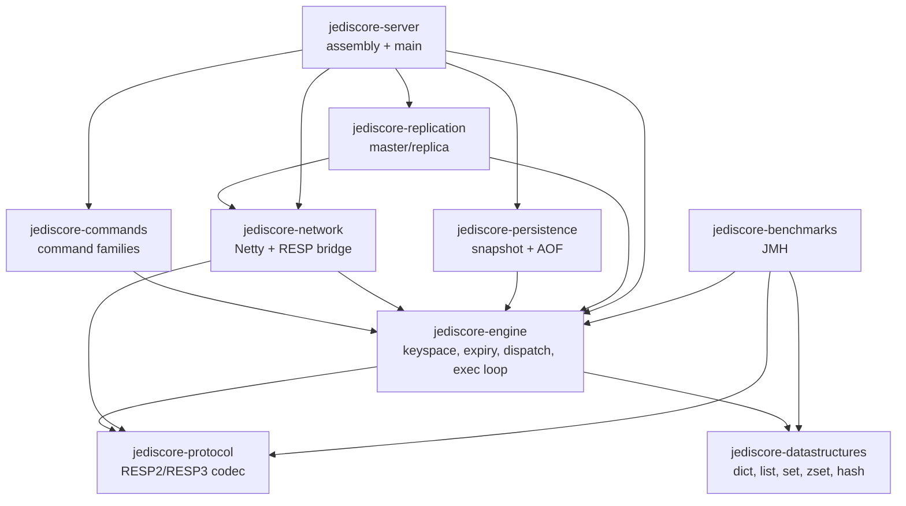
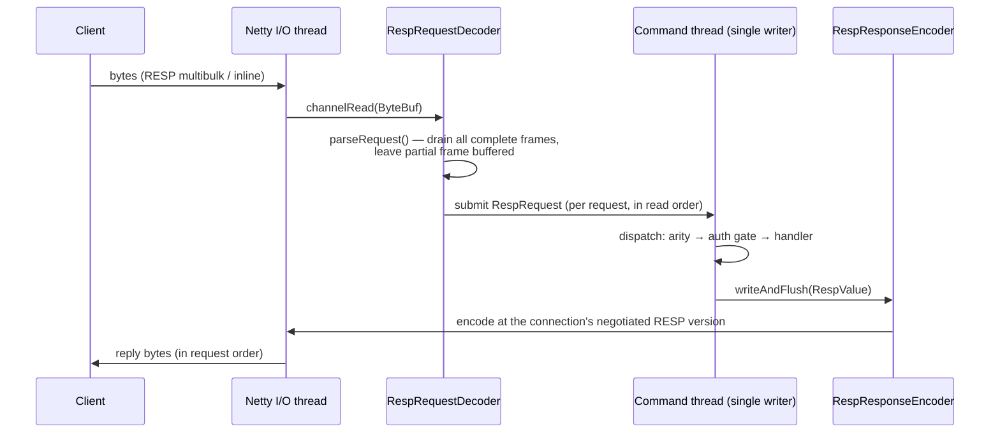
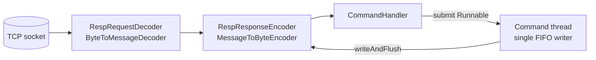
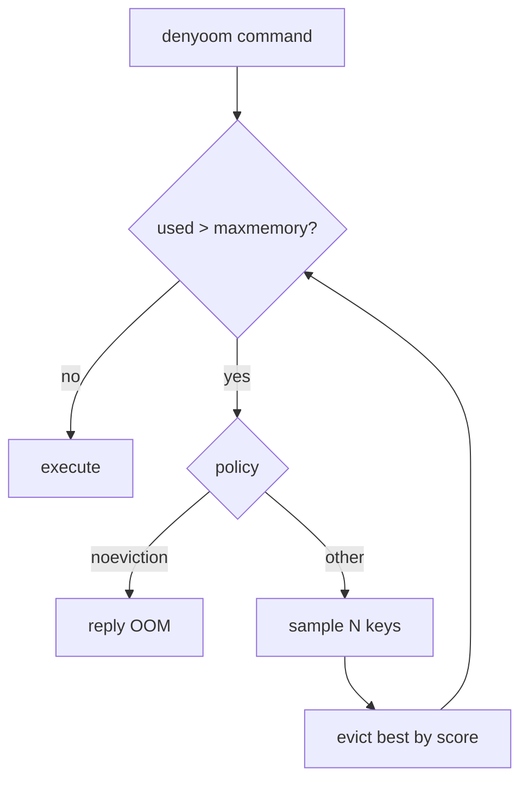
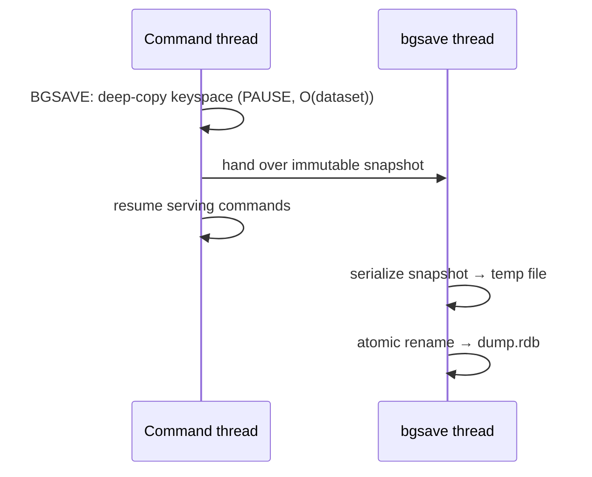
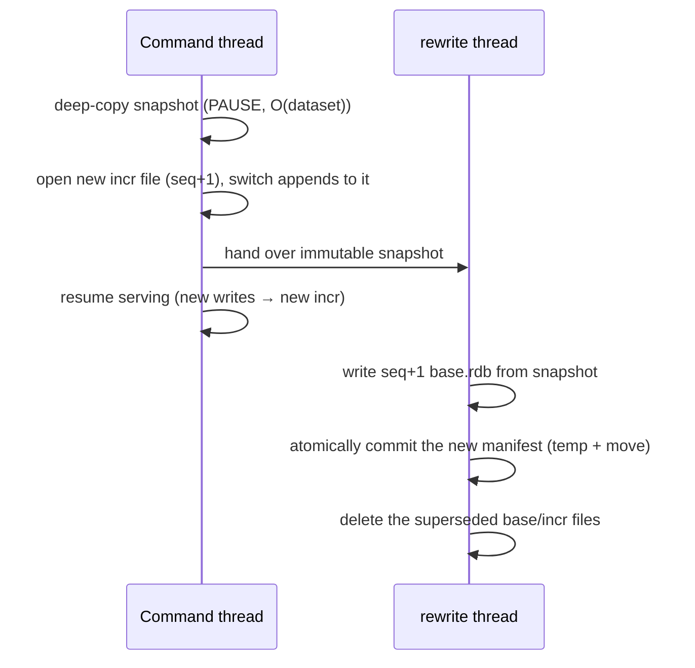
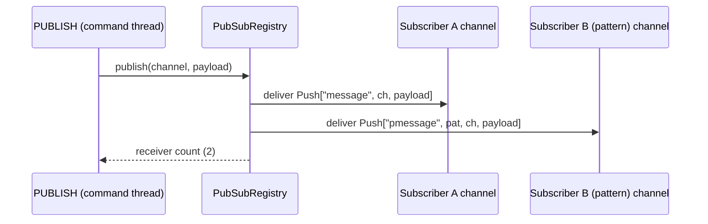
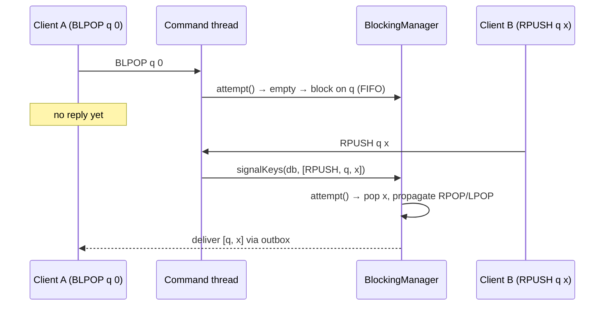
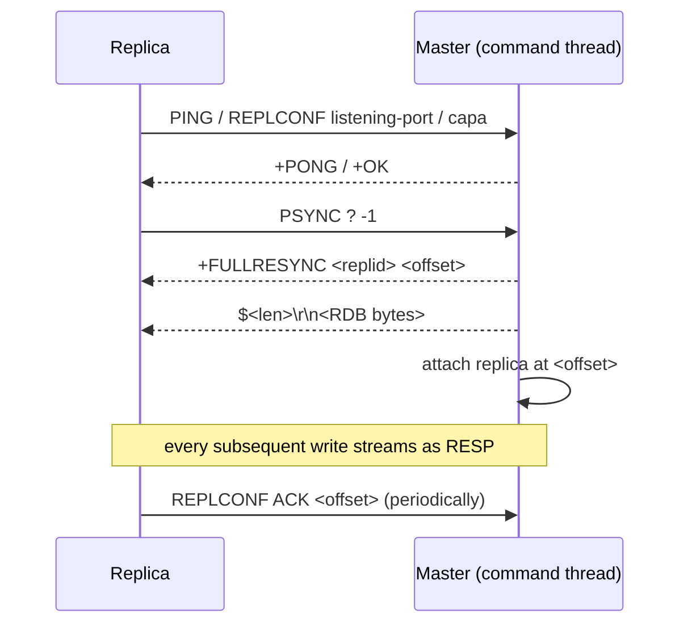
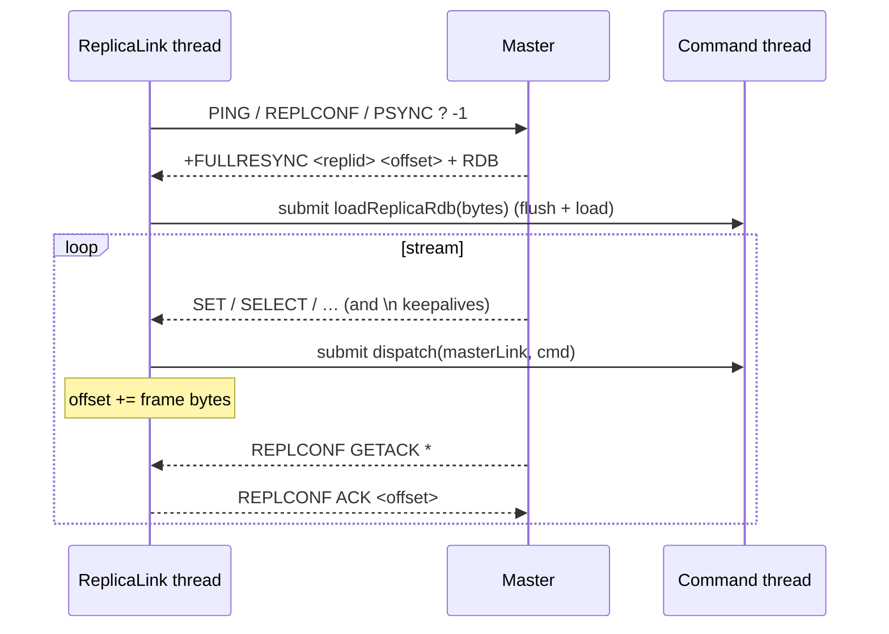

# JediCore Architecture

This document is the living architectural record for JediCore. It is updated every
phase. Each phase appends to the changelog at the bottom.

## Goals and non-goals

**Goals**
- Wire-compatible with Redis (RESP2/RESP3); `redis-cli`, Jedis and Lettuce work unmodified.
- Clean separation of concerns across network, protocol, dispatch, data structures,
  persistence, and replication.
- A correct, explicitly stated and defended concurrency model.
- Performance as a first-class concern: minimal hot-path allocation, pooled buffers,
  primitive collections where they matter.

**Non-goals (for now)**
- Redis Cluster sharding/gossip (the engine is *designed* for sharding but ships single-shard).
- 100% command coverage on day one — commands land family by family (see `COMPATIBILITY.md`).

## Module graph

Modules are decoupled and the dependency graph is acyclic. `protocol` and
`datastructures` are dependency-free leaves; `server` is the only assembly point.



## Concurrency model (the central design decision)

> **Netty I/O threads → a single-writer command-execution loop per shard → virtual
> threads for blocking/background work.**

- **Netty event-loop threads** own sockets and perform RESP framing/parsing, producing
  immutable command objects. They never touch the keyspace.
- **The command thread** is a single thread that executes commands for a given keyspace
  shard. Because exactly one thread mutates a shard, the data structures need **no
  internal locking**, and we get Redis's exact atomicity guarantee: each command is
  atomic, and `MULTI`/`EXEC` is trivially atomic. This is the same bet Redis makes, and
  it is why Redis saturates a NIC on one core — no lock contention, cache-friendly access.
- **Designed for N shards, shipped with 1.** The keyspace is addressable by shard.
  v1 runs a single shard (true Redis semantics, including trivially-correct multi-key
  commands). Multi-shard partitioning by key hash is deliberately deferred until there
  is a correct cross-shard story, because partial sharding silently breaks multi-key
  atomicity.
- **Virtual threads (Java 21)** handle work that must not block the command thread:
  blocking commands (`BLPOP`/`BRPOP`/`WAIT`) modeled as parked clients re-dispatched on
  key-ready events, background persistence flushing, and replication streaming.

**Defense of the trade-off.** A fully multi-threaded engine could use more cores, but a
single-writer loop buys correctness, predictable tail latency, and a vastly simpler
mental model — and Redis itself proves single-threaded execution is enough to be fast.
We keep the door open to sharding without paying its complexity prematurely.

### The fork() problem (persistence, Phase 5 — flagged early, honestly)

Real Redis snapshots by calling `fork()`, getting a copy-on-write view of memory for
free from the OS. **The JVM cannot `fork()`** a copy-on-write child. We will design a
correct alternative (a consistent point-in-time capture driven on the command thread,
e.g. copy-on-write at the data-structure level or a serialized snapshot iterator) and
document its memory/latency trade-offs rather than pretend the fork model exists.

## Build and tooling

- **Gradle (Kotlin DSL)**, multi-module. Shared configuration lives in a single
  convention plugin (`buildSrc/.../jediscore.java-conventions.gradle.kts`).
- **Version catalog** (`gradle/libs.versions.toml`) is the single source of dependency
  and plugin versions, imported into `buildSrc` so build logic never drifts from it.
- **Java 21 toolchain** is pinned in the convention plugin; the Foojay resolver
  auto-provisions it where absent.
- **CI** (GitHub Actions) builds, runs all tests, and runs a JMH smoke benchmark, with
  Gradle caching.

## Network & protocol layer (Phase 1)

### The RESP codec (`jediscore-protocol`)

The protocol module owns the RESP value model and codec and depends on
`netty-buffer` only, so it can parse and encode directly against `ByteBuf`
without copying everything to `String` first. There are deliberately two parse
entry points:

- **`parseRequest(ByteBuf) → byte[][]`** — the server hot path. Clients only ever
  send `*`-multibulk arrays of bulk strings or plain inline lines, so this path
  produces the raw argument vector with no `RespValue` allocation, parsing
  lengths straight off the buffer.
- **`parse(ByteBuf) → RespValue`** — the full model, covering every RESP2/RESP3
  type (used for replies, round-trip tests, and the future client/replication
  paths).

Both are **incremental**: a Java `null` return means "not enough bytes yet" and
the reader index is rewound, so TCP fragmentation is handled by simply waiting
for more data. A genuine RESP null is the singleton `RespValue.NULL`, never a
Java `null`. The **encoder is version-aware**: RESP3-only types are downgraded
to their RESP2 form (null→`$-1`, boolean→`:0/:1`, map→flat array, double/big
number/verbatim→bulk) so a RESP2 client always receives something it can read.

### Request lifecycle



### Channel pipeline & threading



Netty worker threads do only I/O (decode/encode). Each decoded request is handed
to the **single command thread**; the reply is written back from there via
`writeAndFlush` (thread-safe, hops to the I/O thread). Because the executor is a
single FIFO thread and a connection's requests are submitted in read order,
**replies are emitted in request order** — which is what makes pipelining
correct. The negotiated `RespVersion` lives as a `volatile` field on
`ClientConnection` (set on the command thread by `HELLO`, read on the I/O thread
by the encoder).

A protocol violation makes the decoder reply `-ERR Protocol error: <reason>` and
close the connection, exactly as Redis does.

## Keyspace & data types (Phase 2)

### Value model and encodings

Every stored value is a `RedisValue` (a sealed type in `jediscore-datastructures`)
that reports its logical `RedisType` and its current `encoding`. Like Redis,
collections use a compact representation while small and convert to a full
structure past configurable thresholds:

```mermaid
graph TD
    db[Database<br/>dict + expires]
    db --> sv[StringValue<br/>int / embstr / raw]
    db --> hv[HashValue]
    hv -->|≤ hash-max-listpack-entries<br/>and values ≤ hash-max-listpack-value| lp[Listpack<br/>single byte[] arena]
    hv -->|exceeds threshold| ht[hashtable<br/>LinkedHashMap]
    lp -. one-way conversion .-> ht
```

`Listpack` packs all entries into one `byte[]` (length-prefixed), avoiding a heap
object per element — the memory win that makes Redis cheap for the countless
small collections a real workload holds. `OBJECT ENCODING` exposes the live
encoding (`int`/`embstr`/`raw`, `listpack`/`hashtable`).

### Databases and expiration

`ServerContext` holds an array of `Database`s (default 16); a connection's
`SELECT`ed index lives on `ClientConnection`, and `CommandContext.database()`
resolves the right one. Each `Database` is a key→value dict plus a parallel
expires table. Phase 2 uses **lazy expiration**: an expired key is removed on
the next access (and `KEYS`/`DBSIZE` purge as they scan). Active background
sampling is a later performance addition, not a correctness requirement.

### Errors

Command handlers throw `CommandException` for client-facing errors (e.g.
`WRONGTYPE Operation against a key holding the wrong kind of value`,
`ERR value is not an integer or out of range`); the dispatcher converts these to
`-ERR`-style replies, keeping them distinct from unexpected internal bugs.

### Correctness: differential testing against real Redis

The gold-standard test (`RedisDifferentialTest`) uses **jqwik** to generate
random command sequences and replays each against both JediCore and an authentic
Redis, asserting byte-identical replies. It already caught a real bug (`HINCRBY`
with a bad increment was creating the key before validation). It runs against a
Redis from `-Djedicore.diff.redis=host:port` or Testcontainers (CI).

## Expiration, memory accounting & eviction (Phase 3)

### Two-tier expiration

Keys with a TTL are reclaimed two ways, exactly as Redis does:

- **Lazy** — every access (`lookup`) checks the key's expiry and removes it if due.
  Cheap, but leaks memory for keys never touched again.
- **Active** — `ServerCron` (a daemon timer) submits `ActiveExpiry.run` to the
  command thread every 100&nbsp;ms. For each database it samples 20 keys that have
  a TTL, deletes the expired ones, and — if more than 25% of the batch was expired
  — samples again (assuming many stale keys remain), capped per database to bound
  the work. The cron thread itself never touches the keyspace; it only enqueues
  the cycle onto the single command thread, preserving the threading model.

### Memory accounting

Each `RedisValue` reports an approximate `estimateBytes()`; a key's cost adds a
fixed per-key overhead (`MemoryEstimator`). Each `Database` keeps a running
`memoryUsed` total, updated on whole-key writes and removals, and `ServerContext`
sums them for `used_memory`. **Accuracy tradeoff (documented honestly):** the JVM
exposes no allocator-exact byte count the way Redis's `zmalloc` does, so the
numbers are estimates — stable and proportional, not absolute — and *in-place*
mutations (`APPEND`, `LPUSH`, `HSET` on an existing key) are reconciled only when
the key is next written whole. `MEMORY USAGE` accepts `SAMPLES` but computes the
value fully.

### LRU/LFU object metadata

`RedisValue` carries the per-object eviction metadata Redis keeps: a last-access
clock (LRU idle) and an 8-bit **logarithmic LFU counter**. On each access the
counter is first *decayed* toward zero by elapsed minutes, then *probabilistically
incremented* with probability `1/(baseval·log_factor+1)` — so it approximates
`log(access_frequency)` and saturates slowly. Constants use Redis's defaults
(init 5, log-factor 10, decay 1&nbsp;min). `OBJECT FREQ` exposes the counter (LFU
policies only); `OBJECT IDLETIME` exposes idle seconds (non-LFU policies only).

### Eviction algorithm and accuracy tradeoffs

When `used_memory` exceeds `maxmemory`, `Eviction.evictToFit` removes victims
until back under the limit. It does **not** maintain a global LRU/LFU order;
instead, like Redis, it **samples `maxmemory-samples` keys** and evicts the best
one for the policy, repeating as needed. The score is unified so "higher = more
evictable": LRU → idle time, LFU → `255 − frequency`, `volatile-ttl` → soonest
expiry, `*-random` → a random draw. `volatile-*` policies only sample keys with a
TTL, so persistent keys are never their victims. The dispatcher runs eviction
before any data-adding (`denyoom`) command and returns
`OOM command not allowed…` if the limit still can't be met (always so under
`noeviction`).



**Accuracy:** eviction is approximate — the victim is the best of a small sample,
not the global optimum, and accuracy rises with the sample size. Redis additionally
keeps a 16-entry candidate pool across calls for a better approximation; JediCore
uses the simpler per-call sampling (documented). Memory enforcement is exact for
whole-key writes (which the eviction tests drive via `SET`) and approximate under
in-place growth.

## Persistence — RDB (Phase 4A)

### The fork-free snapshot (and its pause)

Real Redis `BGSAVE` calls `fork()`: the child inherits a copy-on-write view of
memory and serializes it while the parent serves, so the only pause is the
`fork()` itself (O(page-table size), ~ms). **The JVM cannot `fork()`**, so:

- **`SAVE`** serializes synchronously on the command thread (it already holds the
  thread; a reference snapshot is enough).
- **`BGSAVE`** takes a **consistent deep-copy snapshot** of the keyspace on the
  command thread (the stop-the-world pause), then a background thread serializes
  that immutable snapshot while the command thread resumes serving.



**Pause characteristic (honest).** The pause is **O(dataset size)** — the time to
deep-copy every value — not O(page tables) as with `fork()`. Measured ≈ **0.81 ms
for 10,000 keys**, so roughly ~80 ms at 1M keys: larger than Redis's fork, and
the price of lacking COW fork. A true mutation-time COW scheme would shrink it but
needs to intercept every in-place mutation; that is deferred. `SAVE` avoids the
copy but blocks the whole time it serializes.

### RDB format & cross-compatibility

JediCore is wire-compatible with `redis-server` in both directions (proven against
Redis 7.4):

- **Writing**, it emits the *plain* type encodings — string, list-of-strings,
  set, hash, ZSET_2 (binary scores) — the `"REDIS0011"` header, per-key
  `EXPIRETIME_MS` opcodes, `EOF`, and the trailing little-endian **CRC-64/redis**
  checksum (reflected Jones polynomial; verified by Redis on load).
- **Reading**, it parses both those and the compact encodings Redis 7.x actually
  writes — **intset**, **listpack**, **quicklist v2** — plus **int-encoded** and
  **LZF-compressed** strings, and the aux/idle/freq/function opcodes. Loaded
  collections re-derive their encoding from the configured thresholds. Truly
  legacy ziplist encodings and stream/module payloads are rejected with a clear
  error (Redis 7.x doesn't write them for the core types).

`DEBUG RELOAD` round-trips the live keyspace through this codec; startup loads
`dump.rdb` from `dir`; save points (`save 900 1`) trigger `BGSAVE` from the cron
once the dirty counter and elapsed time both clear a threshold.

## Persistence — AOF (Phase 4B)

### Multi-part layout (Redis 7+)

When `appendonly yes`, JediCore writes the Redis 7 multi-part AOF into
`appendonlydir/`:

- `appendonly.aof.<seq>.base.rdb` — a base snapshot in **RDB format** (reusing the
  Phase 4A writer), holding the dataset as of the last rewrite.
- `appendonly.aof.<seq>.incr.aof` — every write command since that base, encoded as
  **RESP multibulk** exactly as received on the wire.
- `appendonly.aof.manifest` — plain-text index, one line per file:
  `file <name> seq <n> type <b|i>`.

### Write propagation

After a write command succeeds on the command thread, the dispatcher feeds it to
the AOF verbatim (`WriteCommands.isWrite` gates the set of mutating commands). A
`SELECT <db>` is injected whenever the target database differs from the last one
written, so replay restores per-DB placement. **Honest limitation**: commands are
propagated *as issued* — there is no `SPOP`→`SREM` or `EXPIRE`→`PEXPIREAT`
rewriting, so a replayed `EXPIRE` is relative to load time, not the original
instant. A rewrite (below) collapses this drift by re-snapshotting current state.

### fsync policies

`appendfsync` controls durability vs throughput:

- **`always`** — `fsync` after every command, before its reply returns. Survives a
  hard kill with zero loss (verified by `Stop-Process -Force`); ~110× slower.
- **`everysec`** — `fsync` once per second from the `ServerCron`. At most ~1 s of
  writes lost on a crash.
- **`no`** — only flush to the OS page cache; the OS decides when to `fsync`.

Measured append throughput (JMH): `always` ≈ 2.3k ops/s, `everysec` ≈ 253k,
`no` ≈ 258k — the disk-latency-vs-memory gap.

### Fork-free rewrite (`BGREWRITEAOF`)



The incr-file switch happens **on the command thread**, so no write is lost to the
rewrite. **Documented crash window**: if the process dies after the incr switch but
before the manifest commit, the old manifest still points at the old (complete)
files, so startup loads the pre-rewrite state plus any new-incr writes are
discarded — consistent, never corrupt. The base write and manifest commit are
atomic (`Files.move`), so the manifest never references a half-written base.

### Startup

`loadOnStartup` prefers the AOF when `appendonly yes`: it parses the manifest,
loads the base via the RDB stream reader (skipping already-expired keys), then
replays each incr file through the `CommandDispatcher` against a synthetic
connection whose `loading` flag suppresses re-appending. Otherwise it falls back to
`dump.rdb`. `DEBUG RELOAD` always round-trips through RDB regardless of AOF.

## Pub/Sub (Phase 5A)

### Pushing to a client without coupling the engine to Netty

The keyspace is mutated only on the command thread, but pub/sub needs that thread
to push frames to *other* connections' sockets. The engine deliberately has no
Netty dependency, so the bridge is a one-line interface:

```java
@FunctionalInterface
public interface ClientOutbox { void send(RespValue message); }
```

The network layer attaches one per connection on connect
(`message -> channel.writeAndFlush(message)`), and `ClientConnection.deliver`
calls it. Because the subscriber's own command replies and the messages pushed to
it are **both emitted from the single command thread**, Netty preserves their
relative order on the channel — a subscribe confirmation never races ahead of an
earlier reply.

### The fan-out registry

`PubSubRegistry` holds three inverted indexes — channel→subscribers,
pattern→subscribers, shard-channel→subscribers — keyed by the binary-safe `Bytes`
wrapper. It is **confined to the command thread**: every subscribe, publish, and
introspection call runs inside a command, and disconnect cleanup is *submitted to
the command thread* rather than run on the I/O thread. That confinement is the
same single-writer discipline the keyspace uses, so the maps need no locking.



Messages and (un)subscribe confirmations are `RespValue.Push`, which the encoder
renders as a RESP3 `>` push and downgrades to a plain array in RESP2 — exactly
Redis's behaviour. (Un)subscribe commands emit one frame per channel via the
outbox and return `null`, so the dispatcher writes no extra reply.

### Subscriber-mode restriction

While a **RESP2** connection holds any subscription, the dispatcher permits only
`(P|S)SUBSCRIBE` / `(P|S)UNSUBSCRIBE` / `PING` / `QUIT` / `RESET`; everything else
returns an error. `PING` then replies in the `["pong", message]` array form so it
is distinguishable from a delivered message. **RESP3** lifts the restriction
entirely, because pushes are an out-of-band frame type that interleaves cleanly
with normal replies. Sharded pub/sub keeps a separate index, so a regular
`PUBLISH` never reaches a shard subscriber and `SPUBLISH` never reaches a regular
one.

## Transactions (Phase 5B)

### Queueing

`MULTI` sets a per-connection flag. The dispatcher then intercepts: every command
that is not a transaction-control command (`MULTI`/`EXEC`/`DISCARD`/`WATCH`/
`RESET`/`QUIT`) is checked for existence and arity and **queued**, replying
`+QUEUED`. A queue-time failure (unknown command, wrong arity, NOAUTH) sets a
`transactionError` flag so `EXEC` aborts with `-EXECABORT`; a *runtime* error
(e.g. `WRONGTYPE`) does not abort — it simply becomes one element of the results
array, matching Redis. `EXEC` replays the queue by calling back through
`dispatch()` with the MULTI flag already cleared, so each command takes the normal
path and its write-tracking / CAS / AOF side effects fire as usual.

### Optimistic locking (CAS) — and the in-place-mutation problem

`WATCH` registers `(db, key) → connection` in a command-thread-confined
`WatchTable`; a modification flags every watcher `casDirty`, and `EXEC` then
returns a nil array instead of running the queue. The subtlety is signalling "key
modified" faithfully, because **in-place aggregate mutations do not re-store the
value** — `LPUSH` on an existing list mutates the `ListValue` in place, so a
`Database.put` hook would never see it. Two complementary signals close the gap:

1. **An always-on `Database` `KeyspaceListener`** on `put`/`remove`/`setExpireAt`/
   `persist`/`clear` catches creation, deletion, **expiration** (lazy and active,
   since both route through `remove`), TTL changes, flush, and cross-db
   `MOVE`/`COPY`.
2. **A dispatcher arg-scan** after each successful write touches watched keys (in
   the current db) that appear among the command's arguments — covering the
   in-place-aggregate case, where the key is always an argument.

Together they never *under*-touch (no lost update). The only over-approximation is
an argument value colliding with a watched key's bytes, which aborts a transaction
more eagerly than Redis — safe, and documented. The arg-scan is **O(args)** and
short-circuits when no key in the db is watched (≈ 2 ns on the hot write path).
`SWAPDB` re-indexes the swapped databases so the modification signal (which carries
the db index) stays aligned with the slot under which watches are registered, and
touches all watchers in both databases.

## Blocking commands (Phase 5C)

### The constraint, and the wait-queue

The single command thread must **never block** — so `BLPOP` on an empty key cannot
wait inline. Instead the command registers the client in a `BlockingManager` and
returns no reply (`dispatch` returns `null`, so `CommandHandler` writes nothing);
the command thread keeps serving. The eventual reply is pushed out-of-band through
the same `ClientOutbox` that pub/sub uses. This is an **event-driven wait-queue**,
deliberately chosen over a (virtual or platform) thread parked per blocked client:
it costs nothing while idle and keeps every keyspace mutation on the one thread.



### One operation, two call sites

A blocking command builds a `BlockingOp` whose `attempt()` runs the *real* pop. It
is called once immediately (so a ready key replies synchronously) and again each
time a key it waits on is signalled — so blocking and non-blocking semantics are
identical by construction, and every wakeup **re-validates** the condition. A
signal that finds the key empty, already drained by an earlier waiter, or turned
into the wrong type is handled correctly (a type clash unblocks the client with a
`WRONGTYPE` error). On success the op propagates the **effective** command
(`LPOP`/`RPOP`/`LMOVE`/`ZPOPMIN`…) to the AOF and WATCH layer — a blocking command
is never itself written to the AOF, since replaying it could block during load.

### FIFO, timeouts, chaining, and EXEC

Each `(db, key)` keeps an insertion-ordered deque, so the longest-waiting client
wins. Timeouts use a shared daemon scheduler that fires at the deadline and
*submits* the timeout to the command thread — precise, single-threaded, no
busy-waiting. Serves that themselves make a key ready (`BLMOVE` pushing to its
destination) enqueue a follow-up signal drained iteratively, so chained wakeups
(`BLMOVE` → a blocked `BLPOP`) never recurse. Inside `EXEC` (and any
`blockingAllowed = false` context) an unsatisfiable command returns its timeout
reply immediately instead of parking. The per-write signal is gated by a cheap
`hasBlockedClients()` check (≈ 1 ns when no one is blocked).

## Scripting (Phase 5D)

### Execution model

A script runs **on the command thread** — `EVAL` is dispatched there like any
command — so `redis.call` is just a synchronous re-entry into
`dispatcher.dispatch(...)`. There is no concurrency to guard and no atomicity gap:
the whole script is one unit of work on the single writer, exactly as Redis
intends. Writes use **effects replication**: each inner `redis.call` propagates its
effective command to the AOF/WATCH layer through the normal dispatch path, while
`EVAL` itself is never written to the AOF.

LuaJ (a pure-JVM Lua 5.1) is the embedded interpreter — the one runtime dependency
beyond the core four, and the engine the spec names. One sandboxed `Globals` is
reused across scripts: `os`/`io` and the module loaders are removed, and a
metatable `__newindex` rejects creation of global variables (Redis's "Script
attempted to create global variable" protection). `KEYS`/`ARGV` are rebound per
call via `rawset` (bypassing the guard), and compiled chunks are cached by SHA-1,
so repeated `EVAL`/`EVALSHA` skip recompilation.

### Value conversion (the crux)

The bridge converts both directions, matching Redis's rules:

| Redis → Lua | Lua → Redis |
|-------------|-------------|
| integer → number | number → integer (truncated) |
| bulk/`nil` → string/`false` | string → bulk, `true`→`1`, `false`/`nil`→nil |
| status → `{ok=…}` | `{ok=…}` → status |
| error → `{err=…}` | `{err=…}` → error |
| array → 1-indexed table | table → array (first `nil` terminates) |

A subtlety LuaJ forces: a numeric *string* like `"123"` reports `isnumber()` true,
so the Lua→Redis classifier keys off the exact `type()` — otherwise a returned
string would wrongly become an integer. Strings are converted **binary-safe** via
`LuaString`'s raw bytes. `redis.call` raises a `LuaError` on a Redis error (the
uncaught error becomes the script's reply); `redis.pcall` returns the `{err=…}`
table instead.

## Replication — master side (Phase 6A)

### PSYNC full resync, gap-free

When a replica sends `PSYNC ? -1`, the master — in a single command-thread step —
captures the current `master_repl_offset`, replies `+FULLRESYNC <replid> <offset>`,
streams the RDB as a bulk header with no trailing CRLF (`$<len>\r\n` + payload),
and registers the connection as a replica. Because the snapshot and the
registration happen without any other command interleaving (single writer), there
is **no gap** between the point the RDB represents and where the live stream
begins.



The RDB is produced via a new `Persistence.dumpRdb()` SPI (the engine stays
unaware of the file format). Streaming reuses the pub/sub delivery path: a new
`RespValue.Raw` carries pre-encoded bytes verbatim, so the encoder writes the RDB
preamble and exact command bytes without reframing — which matters because the
**replication offset is a byte count** and must match what the replica computes.

### The stream, the offset, and the backlog

Propagation is a single shared byte sequence shared by all replicas: each write is
encoded once, the offset advances by its length, the bytes are appended to a
`ReplicationBacklog` ring buffer, and pushed to every replica. A `SELECT` is
injected on a database change; attaching a replica resets that state so the first
command re-selects (guarding a freshly-synced replica that assumes db 0). A server
that has never had a replica pays nothing — the stream activates on first attach,
then stays active across reconnects so a brief drop can be served by a partial
resync (Phase 6C).

### Deterministic propagation (and the rewriting framework)

Non-deterministic commands must be rewritten so replicas and the AOF converge.
`CommandContext.propagate(cmd)` lets a handler replace what is propagated; the
dispatcher feeds the override (or the verbatim command) to **both** the AOF and the
replication stream — one mechanism, so it also closed the determinism gap the AOF
had in 4B. 6A rewrites `EXPIRE`-family → `PEXPIREAT` (absolute) and `SPOP` →
`SREM`/`DEL` (the actually-removed members); verified against a real replica, whose
set converged to the exact same members the master kept. `WAIT` solicits acks with
`REPLCONF GETACK *` and counts replicas whose acknowledged offset reaches the
target, blocking on the Phase 5C wait-queue until enough ack or the timeout fires.

### Consistency model (honest)

Replication is **asynchronous**: a write is acknowledged to the client as soon as
the master applies it, *before* any replica has received it. So a master crash can
lose the most recent writes that had not yet reached a replica — the standard Redis
async-replication window. `WAIT n timeout` lets a client bound this by blocking
until `n` replicas acknowledge, but even `WAIT` is best-effort (it can time out and
report fewer). There is no synchronous replication and no automatic failover yet
(Sentinel is Phase 6C). A replica reflects the master's state at some recent offset;
under load it lags by the network + apply latency.

## Replication — replica side (Phase 6B)

`REPLICAOF host port` hands off to a `ReplicaLink` (in `jediscore-replication`,
behind the engine's `MasterLink` interface). A single daemon thread owns the
outbound socket: it performs the `PING`/`REPLCONF`/`PSYNC` handshake, reads the
master's RDB, and then the command stream — but it **never touches the keyspace
directly**. The RDB load and every applied command are *submitted to the command
thread*, so the single-writer invariant is preserved even though replication I/O
runs on its own thread.



Applied commands run through the normal dispatcher on a synthetic **master-link
connection** flagged to bypass read-only; `SELECT` frames in the stream set that
connection's database, so writes land in the right db. The replica counts the
exact bytes it consumes (the `RespParser` resets its reader index on a partial
frame, so a frame's length is an exact reader-index delta), answers `REPLCONF
GETACK` immediately, and reconnects with a full resync if the link drops.

Two real-Redis wrinkles the link handles: **bare `\n` keepalives** (skipped in the
handshake and in the stream, counted toward the offset) and **diskless `$EOF:`
transfer** — when the master streams the RDB with no length prefix, the payload
runs until a random 40-byte marker reappears, read byte-by-byte so the command
stream that follows is never over-consumed. **Read-only mode** rejects client
writes with `READONLY` while a replica; `INFO`/`ROLE` report the slave fields.

## Replication — partial resync &amp; failover (Phase 6C)

### Partial resync

A briefly-disconnected replica should not have to re-transfer the whole dataset.
On reconnect it sends `PSYNC <replid> <offset>` where the offset is the **next
byte it wants** (Redis's 1-based convention: `received + 1`). The master serves a
partial resync when the replid matches its own *and* the requested position is
still within the `ReplicationBacklog` ring: it replies `+CONTINUE <replid>` and
streams exactly the missed bytes (`backlog.since(boundary)`, `boundary = offset -
1`), then attaches the replica at the current offset. If the replid differs (the
master restarted, hence a fresh replid) or the offset has scrolled out of the ring,
it falls back to a full resync. The replica caches its replid and offset across
reconnects and adopts the replid `+CONTINUE` returns.

The byte convention is the subtle part: the offset is a count of stream bytes, so
the backlog is addressed by a *boundary* (bytes already delivered) and the wire
offset is `boundary + 1`. Getting this exactly right is what lets a real replica
partial-resync from us and us from a real master.

### Failover (design — not implemented)

Automatic failover (Redis Sentinel / Cluster) is **documented but not built**; the
`SENTINEL`/`FAILOVER` commands return an honest error pointing here. **Manual
failover works today**: `REPLICAOF NO ONE` on the chosen replica promotes it to
master, then `REPLICAOF <new-master>` repoints the others.

A minimal Sentinel would add: (1) a monitor that pings masters/replicas and flags a
master subjectively down after a timeout; (2) a gossip round so a quorum of
sentinels agree it is objectively down; (3) a leader election (e.g. Raft-style
term + votes) among the sentinels; (4) the leader picking the most-caught-up
replica (highest `slave_repl_offset`), issuing `REPLICAOF NO ONE` to it and
`REPLICAOF <new>` to the rest, and updating clients via pub/sub
(`+switch-master`). The pieces JediCore already has — `INFO replication`/`ROLE`
for health and offsets, `REPLICAOF` for repointing, pub/sub for notifications —
are the building blocks; the missing part is the multi-sentinel consensus, which
is its own subsystem and is deferred.

## Observability — INFO &amp; live stats (Phase 7A)

A single `ServerStats` holder carries the counters behind `INFO stats`. Most are
command-thread-confined plain `long`s (commands processed, keyspace hits/misses,
expirations, evictions, the ops/sec sample) read by `INFO` on that same thread;
the connection counters are `AtomicLong`s because Netty I/O threads bump them. The
wiring is one increment at each natural choke point: the dispatcher
(`recordCommand`), `CommandHandler.channelActive` (`recordConnection`),
`Database.lookup` (hit/miss), `Database.expireIfNeeded` (lazy expiry), the cron
(active-expiry batch total + `sampleOps`), and `Eviction` (`recordEviction`).
`instantaneous_ops_per_sec` is recomputed each 100 ms cron tick from the delta in
commands processed.

`INFO` renders nine sections — Server, Clients, Memory, Persistence, Stats,
Replication, CPU, Cluster, Keyspace — from the live registries (`ServerStats`,
`ReplicationManager`, `BlockingManager`, `PubSubRegistry`, `Persistence`, the
databases) and supports the section-name filter. Honest approximations are
documented inline: `used_memory_rss` is the JVM heap-in-use, CPU is the total
process CPU time attributed to user, and `total_net_*_bytes` are not yet tracked.
Verified parseable by real `redis-cli` (`INFO server`/`stats`/`keyspace`).

## Changelog

### Phase 7A — INFO &amp; live stats
- **`ServerStats`** (engine): command-thread `long`s + `AtomicLong` connection
  counters; `instantaneous_ops_per_sec` sampled by the cron; `reset()` for the
  upcoming `CONFIG RESETSTAT`.
- **Wiring**: dispatcher, `CommandHandler`, `Database` (hits/misses/lazy-expiry),
  `ServerCron` (active-expiry total + ops sample), `Eviction`; small counters added
  to `BlockingManager`/`PubSubRegistry`/`ReplicationManager` (blocked clients,
  pub/sub channel counts, resyncs served).
- **`ServerCommands.INFO`** with all nine sections and the section filter; moved
  `INFO` out of `ReplicationCommands` into its own home.
- **Tests**: 5 INFO integration tests (all sections present, server identity, stats
  reflect activity, live clients/memory, keyspace key/expire counts) + a manual
  real-`redis-cli` `INFO` parse check. Per-command overhead is a couple of `long`
  increments — negligible on the hot path.

### Phase 6C — Partial resync, deterministic rewrites, Sentinel design
- **Partial resync**: master serves `+CONTINUE` from the backlog when a replica's
  replid matches and its offset is retained; the replica caches replid/offset and
  requests `PSYNC <replid> <offset+1>` on reconnect, falling back to full resync
  otherwise.
- **More deterministic rewrites**: `SET … EX/PX`→`SET … PXAT`, `SETEX`/`PSETEX`→
  `SET … PXAT`, `GETEX`→`PEXPIREAT`/`PERSIST`, `INCRBYFLOAT`→`SET`,
  `HINCRBYFLOAT`→`HSET` (concrete result) — feeding both replicas and the AOF.
- **Replica-side partial resync** is covered end-to-end: a test hook drops the link
  transiently and asserts the replica reconnects with `+CONTINUE` (no second full
  resync) and converges on writes made during the gap.
- **Sentinel**: `SENTINEL`/`FAILOVER` stubbed with a clear error; the failover
  design is documented above. Manual failover via `REPLICAOF NO ONE` works.
- **Tests**: backlog ring unit tests (slice/evict/wrap), master partial-resync +
  replid-mismatch-forces-full + `SETEX`-rewrite integration tests, and a
  Testcontainers both-ways cross-compat IT (CI; skips locally — the manual
  equivalents were run against real Redis 7.4).

### Phase 6B — Replication (replica side)
- **`ReplicaLink`** (`jediscore-replication`, implements the engine's new
  `MasterLink`): outbound handshake, RDB load, stream apply, `REPLCONF ACK`/
  `GETACK`, reconnect-with-full-resync; submits all keyspace changes to the command
  thread.
- **Replica state** in `ReplicationManager` (role, master host/port, link status,
  replica offset, observed master replid); **read-only** enforcement in the
  dispatcher (master-link exempt); `Persistence.loadReplicaRdb` SPI (flush + load).
- **`REPLICAOF`/`SLAVEOF`** wired to the link; `INFO`/`ROLE` report replica fields.
- Handles real-Redis **diskless `$EOF:` RDB** transfer and **`\n` keepalives**.
- **Tests**: 4 replica-side tests (RDB + live-stream convergence, read-only
  rejection, `REPLICAOF NO ONE` promotion, `ROLE`/`INFO` slave) with two in-process
  instances; plus a manual cross-compat run where **our server replicated from a
  real Redis 7.4 master** (diskless RDB loaded, live stream incl. `EXPIRE` applied,
  DBSIZE converged).

### Phase 6A — Replication (master side)
- **`ReplicationManager`** (engine, command-thread-confined): replid (from run id),
  `master_repl_offset`, attached-replica set, shared propagation stream with
  `SELECT` injection, and a `ReplicationBacklog` ring buffer.
- **`PSYNC`/`SYNC`** full resync (gap-free), **`REPLCONF`** (listening-port/capa/
  ACK/GETACK), **`INFO replication`**, **`ROLE`**, and a `REPLICAOF` stub.
- **`RespValue.Raw`** for verbatim byte streaming (RDB preamble + exact command
  bytes); **`Persistence.dumpRdb()`** SPI for the full-resync image.
- **Propagation-rewrite framework** (`CommandContext.propagate`/`suppressPropagation`)
  feeding both the AOF and replicas; `EXPIRE`-family→`PEXPIREAT` and `SPOP`→`SREM`
  rewrites; **`WAIT`** now counts real replica acks.
- **Tests**: 6 master-side tests via a raw-socket replica (full resync + stream,
  `PEXPIREAT` and `SREM` rewriting, `WAIT`, `INFO`/`ROLE`); plus a manual
  cross-compat run where a **real Redis 7.4 replica synced from our master**, took
  the live stream, and converged exactly (incl. `SPOP`→`SREM` determinism and
  `EXPIRE`→absolute TTL).
- **Benchmark**: per-write propagation ≈ 0.5 µs (encode + backlog + fan-out),
  independent of replica count; zero when no replica has ever attached.

### Phase 5D — Lua scripting
- **`ScriptingCommands`**: `EVAL`/`EVALSHA`/`SCRIPT LOAD`/`EXISTS`/`FLUSH` on an
  embedded LuaJ interpreter; SHA-1 script cache + compiled-chunk cache; sandboxed,
  global-write-protected `Globals` reused across calls with per-call `KEYS`/`ARGV`.
- **`redis` library**: `call`/`pcall` (re-entering the dispatcher with
  `blockingAllowed=false`, rejecting NOSCRIPT commands), `error_reply`,
  `status_reply`, `sha1hex`, `log`.
- **Conversions**: full Redis↔Lua mapping, binary-safe, `type()`-based to avoid the
  numeric-string trap; effects-replication propagation of inner writes.
- **Dependency**: `org.luaj:luaj-jse:3.0.1` (the sanctioned scripting dependency).
- **Tests**: 14 end-to-end tests — conversions both ways, `KEYS`/`ARGV`, key
  manipulation via `redis.call`, an INCR loop, error/status helpers, call-aborts
  vs pcall-catches, EVALSHA/SCRIPT EXISTS/FLUSH, the SHA-1 vector, the sandbox
  (global + `os`), NOSCRIPT rejection, and numkeys validation. Plus manual
  real-`redis-cli` interop (table return, `redis.call` write, SCRIPT LOAD).
- **Benchmark**: warm-cache `EVAL` ≈ 0.65 µs for a trivial script, ≈ 1.14 µs with a
  `redis.call('set')`.
- **Deferred**: Redis 7 `FUNCTION`s, and the `cjson`/`cmsgpack`/`struct`/`bit`
  helper libraries.

### Phase 5C — Blocking commands
- **`BlockingManager`**: command-thread-confined per-`(db,key)` FIFO wait-queues;
  event-driven serve on write signals; daemon-scheduler timeouts submitted back to
  the command thread; iterative signal draining for chained wakeups; disconnect/
  RESET cancellation.
- **`BlockingOp`**: the retry body shared by the immediate attempt and every
  wakeup; serves propagate the effective non-blocking command.
- **`CommandContext.blockingAllowed`**: `EXEC` replays with it false so blocking
  commands don't park inside a transaction; `ServerContext.propagateWrite` lets a
  served block mark dirty / invalidate WATCH / feed the AOF.
- **Dispatcher**: signals ready keys after each write (behind a `hasBlockedClients`
  gate).
- **Commands** (`BlockingCommands`): `BLPOP`/`BRPOP`/`BLMOVE`/`BRPOPLPUSH`/
  `BLMPOP`/`BZPOPMIN`/`BZPOPMAX`/`WAIT`.
- **Tests**: 13 end-to-end tests — immediate service, async wakeup, FIFO ordering,
  precise timeout (deadline honoured), chained BLMOVE→BLPOP, wrong-type unblock,
  BZPOP/BLMPOP, WAIT (immediate and timeout), and non-blocking-inside-MULTI.
- **Benchmark**: per-write readiness signal ≈ 1.3 ns with nobody blocked (the
  common path), ≈ 49 ns with blocks on unrelated keys — O(args), independent of
  blocked-client count.

### Phase 5B — Transactions
- **`WatchTable`**: command-thread-confined `(db, key) → watchers` CAS table with a
  per-connection `casDirty` flag; `touch`/`touchAll`/`touchByArguments`.
- **`KeyspaceListener`** wired into `Database` (put/remove/setExpireAt/persist/
  clear) to drive CAS invalidation on ambient modifications (expiration, flush,
  cross-db writes); `Database` index made slot-aligned across `SWAPDB`.
- **Dispatcher**: MULTI queueing (`+QUEUED`, EXECABORT on queue-time errors) and a
  per-write arg-scan CAS touch; `ServerContext` now publishes the dispatcher so
  `EXEC` can replay queued commands through it.
- **`ClientConnection`**: transaction queue + `inMulti`/`transactionError`/
  `casDirty` + watched-key set; `RESET` and disconnect clear them.
- **Protocol**: added `RespValue.NullArray` (RESP2 `*-1`, RESP3 `_`) so `EXEC`'s
  CAS-failure reply is a true nil multibulk, not a nil bulk.
- **Commands** (`TransactionCommands`): `MULTI`/`EXEC`/`DISCARD`/`WATCH`/`UNWATCH`.
- **Tests**: 11 end-to-end tests — ordered EXEC, DISCARD, CAS abort vs success,
  different-key non-interference, in-place-mutation and expiration invalidation,
  EXECABORT, runtime-error-doesn't-abort, WATCH-inside-MULTI, EXEC-without-MULTI,
  and an 8-thread concurrent CAS-increment test (400 increments, 0 lost, 1697
  contention retries).
- **Benchmark**: per-write CAS bookkeeping ≈ 2 ns with no watchers (the common
  path), ≈ 21 ns once watches exist — O(args), independent of watcher count.

### Phase 5A — Pub/Sub
- **`ClientOutbox`**: one-way engine→network bridge for out-of-band pushes; the
  network layer attaches `channel::writeAndFlush`, keeping the engine Netty-free.
- **`PubSubRegistry`**: command-thread-confined channel/pattern/shard inverted
  indexes (binary-safe `Bytes` keys); disconnect cleanup submitted to the command
  thread, so no locks. Glob matching reuses the datastructures `Glob`.
- **`ClientConnection`**: per-connection subscription sets, `inSubscribeMode`, the
  volatile outbox; `RESET` drops subscriptions.
- **Dispatcher**: RESP2 subscriber-mode command gating (RESP3 exempt).
- **Commands** (`PubSubCommands`): `SUBSCRIBE`/`UNSUBSCRIBE`/`PSUBSCRIBE`/
  `PUNSUBSCRIBE`/`PUBLISH`/`PUBSUB` (CHANNELS/NUMSUB/NUMPAT/SHARDCHANNELS/
  SHARDNUMSUB) + sharded `SSUBSCRIBE`/`SUNSUBSCRIBE`/`SPUBLISH`; `PING` subscriber-
  mode array form.
- **Tests**: 9 end-to-end socket tests — multi-subscriber fan-out, pattern and
  sharded delivery, running confirmation counts, unsubscribe-all, RESP2 gating,
  RESP3 interleaving, PUBSUB introspection, disconnect cleanup. Plus a manual
  real-`redis-cli` interop check (subscribe + publish round-trip).
- **Benchmark**: `PUBLISH` fan-out dispatch ≈ 0.028 µs (1 sub) → 6.9 µs (1000
  subs), ~7 ns per subscriber for frame build + delivery.

### Phase 4B — AOF persistence
- **`AofManager`**: Redis 7 multi-part AOF (`base.rdb` + `incr.aof` + `manifest`),
  verbatim RESP command propagation with `SELECT`-on-DB-change, three `appendfsync`
  policies, fork-free `BGREWRITEAOF` (snapshot + atomic incr switch on the command
  thread; base + manifest committed off-thread; old files deleted), and
  manifest-driven startup replay through the dispatcher.
- **`Snapshots`** helper shared by RDB and AOF (deep-copy snapshot, encoding limits,
  RDB-stream load skipping expired keys); `WriteCommands.isWrite` gating.
- **Wiring**: dispatcher feeds writes to the AOF and marks the dataset dirty;
  `RdbPersistence` is now a facade over RDB + `AofManager`; `JediCoreServer` parses
  `--dir`/`--appendonly`/`--appendfsync`.
- **Command**: `BGREWRITEAOF`.
- **Tests**: AOF round-trip of every type across a restart (incl. `DEL`/`INCR`
  replay), `BGREWRITEAOF` compaction + preservation (110 keys, seq-2 base live /
  seq-1 gone), all three fsync policies parameterized — 5/5 green; plus a manual
  **crash-consistency** test (hard `Stop-Process -Force` under `appendfsync always`:
  all 7 keys survived) and a differential re-run vs real Redis 7.4.
- **Benchmark**: append throughput `always` ≈ 2.3k / `everysec` ≈ 253k / `no` ≈ 258k ops/s.

### Phase 4A — RDB persistence
- **CRC-64/redis** (`Crc64`), RDB constants, **LZF** decompression.
- **`RdbWriter`** (plain encodings, CRC trailer) and **`RdbReader`** (plain +
  intset/listpack/quicklist-v2 + int/LZF strings).
- **Fork-free `RdbPersistence`**: synchronous `SAVE`, deep-copy-snapshot `BGSAVE`,
  startup load, `DEBUG RELOAD`, cron-driven save points. Wired into `ServerContext`
  via a `Persistence` interface; bootstrap loads `dump.rdb` before serving.
- **Commands**: `SAVE`, `BGSAVE`, `LASTSAVE`, `DEBUG RELOAD`.
- **Tests**: round-trip of every type + TTL; CRC-64 check vector; restart
  durability; and a Testcontainers cross-compat IT (both directions) — also
  verified manually here: real `redis-server` loads JediCore's dump, and JediCore
  loads a real-redis dump (intset/listpack/quicklist + a 500-byte LZF string).
- **Benchmark**: `BGSAVE` snapshot pause ≈ 0.81 ms / 10k keys; serialize ≈ 0.63 ms.
- **Done in 4B**: AOF (appendonly, fsync policies, `BGREWRITEAOF`, Redis 7
  multi-part base+incr+manifest, crash-consistency) — see the Phase 4B section.

### Phase 3 — active expiration, memory accounting, eviction
- **Active expiration**: `ActiveExpiry` probabilistic cycle (sample 20, repeat if
  >25% expired), driven on the command thread by `ServerCron` every 100 ms.
- **Memory accounting**: `RedisValue.estimateBytes()` per type, `MemoryEstimator`,
  per-database `memoryUsed`, `ServerContext.usedMemory()`; `MEMORY USAGE`/`DOCTOR`.
- **LRU/LFU metadata**: clock-based logarithmic LFU counter with decay + LRU idle
  on every `RedisValue`; `OBJECT FREQ`/`IDLETIME` with policy gating.
- **Eviction**: `maxmemory` + all 8 policies via sampling (`Eviction`), wired into
  the dispatcher with `denyoom`/OOM semantics; `Dict.sampleKeys` for sampling.
- **Tests**: active-expiry-without-access, memory tracking, all eviction policies
  (incl. deterministic volatile-scope and LRU/LFU ordering with real time gaps),
  and a socket integration test (eviction bound, OOM, MEMORY, OBJECT FREQ gating).
  The differential test re-passes vs Redis 7.4 (eviction inert at maxmemory 0).
- **Benchmarks**: active-expiry cycle 2.64 ops/µs (~0.38 µs/cycle); eviction under
  pressure 1.67 ops/µs.

### Phase 2D — the SCAN cursor family
- **`Dict`**: a custom chained hash table (power-of-two buckets, synchronous
  grow-only resize) implementing Redis's **reverse-binary `SCAN` cursor**. A full
  iteration returns every element present throughout, even across resizes and
  modifications between calls — the guarantee `java.util.HashMap` can't give
  because it doesn't expose buckets. A unit test asserts this completeness while
  the table doubles mid-scan.
- **Migrated to `Dict`**: the keyspace (`Database`), and the hashtable encodings
  of `HashValue`, `SetValue`, and `ZSetValue`. The existing differential test
  (re-run vs Redis 7.4) confirms behaviour is unchanged by the refactor.
- **Commands**: `SCAN` (`MATCH`/`COUNT`/`TYPE`), `HSCAN` (`MATCH`/`COUNT`/
  `NOVALUES`), `SSCAN`, `ZSCAN`. Compact encodings (listpack/intset) are returned
  whole at cursor 0, as in Redis. SCAN correctness is verified by dedicated
  full-iteration completeness tests (cursors are implementation-specific, so they
  are not diffed against Redis cursor-by-cursor).
- **Benchmark** (`ScanBenchmark`): a full scan of 10,000 keys in ~235 µs
  (4.25 full-scans/ms; ~42M keys/s).
- **All five data types and keyspace introspection are now complete.** Next:
  Phase 3 — persistence (the fork-free design), then replication, pub/sub, and
  transactions.

### Phase 2C — sorted sets, expiration, SWAPDB
- **Skiplist**: `SkipList` is a faithful port of Redis's `zskiplist` (per-level
  forward pointers with spans for O(log n) rank). It implements a `SortedIndex`
  interface alongside `TreeMapSortedIndex` (a `TreeSet`-backed alternative kept
  for comparison). A randomized differential unit test asserts the two stay
  observationally identical.
- **Sorted sets** (`ZSetValue`): listpack↔skiplist encoding (the skiplist form
  pairs a `HashMap` member→score with the `SkipList`). Full command set: `ZADD`
  (NX/XX/GT/LT/CH/INCR), `ZINCRBY`, `ZREM`, `ZSCORE`/`ZMSCORE`, `ZRANK`/`ZREVRANK`,
  `ZCARD`, `ZCOUNT`/`ZLEXCOUNT`, `ZPOPMIN`/`ZPOPMAX`, the `ZRANGE` family
  (BYSCORE/BYLEX/REV/LIMIT/WITHSCORES) + `ZREVRANGE*`, `ZRANGESTORE`,
  `ZUNION`/`ZINTER`/`ZDIFF` (+STORE, with WEIGHTS/AGGREGATE), `ZINTERCARD`.
- **Expiration**: `EXPIRE`/`PEXPIRE`/`EXPIREAT`/`PEXPIREAT` (with NX/XX/GT/LT),
  `TTL`/`PTTL`/`EXPIRETIME`/`PEXPIRETIME`, `PERSIST`; plus `SWAPDB`.
- **Differential fuzzer extended** to sorted sets (ZADD/ZSCORE/ZREM/ZCARD/ZRANK/
  ZINCRBY/ZCOUNT/ZRANGE/ZRANGEBYSCORE) and EXPIRE/PERSIST; passes against Redis 7.4.
- **Benchmark** (`ZSetBenchmark`): the headline result is rank — **skiplist 12.6
  vs TreeMap 0.47 ops/µs (~27×; p99 0.2 µs vs 8.4 µs)** on 1000 elements,
  demonstrating why the skiplist is the real structure. ZADD ≈1.2, ZRANGE ≈3.1
  ops/µs on the command path. (TreeMap is competitive on plain insert/delete at
  small N; rank/range is where the skiplist wins, which is what matters.)
- **Deferred to 2D**: the `SCAN`/`HSCAN`/`SSCAN`/`ZSCAN` cursor family (one shared
  reverse-binary-cursor algorithm; doing it "correctly under concurrent
  modification" needs care with our dict, so it gets its own focused pass).

### Phase 2B — lists & sets
- **Lists** (`ListValue`): listpack↔quicklist encoding. `Listpack` now implements
  a `SequenceStore` abstraction; `Quicklist` is a real linked sequence of listpack
  nodes (Redis's design). Full command set: `LPUSH`/`RPUSH`(`X`), `LPOP`/`RPOP`
  (with count), `LRANGE`/`LLEN`/`LINDEX`/`LSET`/`LINSERT`/`LREM`/`LTRIM`,
  `RPOPLPUSH`/`LMOVE`, `LPOS`.
- **Sets** (`SetValue`): the full three-way **intset↔listpack↔hashtable** encoding
  (`IntSet` is a sorted `long[]`). Full command set: `SADD`/`SREM`/`SCARD`/
  `SISMEMBER`/`SMISMEMBER`/`SMEMBERS`, `SPOP`/`SRANDMEMBER`, `SUNION`/`SINTER`/
  `SDIFF` (+ `STORE`), `SINTERCARD`, `SMOVE`.
- **Differential fuzzer extended** to lists (order-deterministic, compared
  directly) and sets (element-returning commands compared as unordered sets). It
  caught two more real bugs — `LREM` and `SMOVE` validated/short-circuited in the
  wrong order relative to Redis (argument parsing and source-missing must precede
  type checks). All fixed; the property passes against Redis 7.4.
- **Benchmarks** (`CollectionBenchmark`, command path, smoke profile): setAdd
  ≈2.2, setIsMember ≈2.2, listRange(10) ≈0.77, listPushPop ≈1.28 ops/µs; p99
  setIsMember ≈0.9 µs, setAdd ≈1.1 µs (the bench set is listpack-encoded, so
  membership is a linear scan — as in Redis).
- **Deferred to 2C**: Sorted Sets (self-implemented skiplist), the
  `SCAN`/`HSCAN`/`SSCAN`/`ZSCAN` cursor family, `SWAPDB`, the `EXPIRE`/`TTL`
  command family, and ZADD/ZRANGE benchmarks.

### Phase 2A — keyspace, strings, hashes (split per the self-management rule)
- **Keyspace**: `Database` (dict + lazy expiry), 16 databases, per-connection
  `SELECT`; `Bytes` binary-safe key wrapper; `CommandException` for typed errors.
- **Encodings**: `Listpack` compact arena; `StringValue` (int/embstr/raw);
  `HashValue` (listpack↔hashtable at `hash-max-listpack-*` thresholds);
  `OBJECT ENCODING` reports the live encoding. `Glob` matcher for `KEYS`.
- **Commands**: full string family (`SET` with all options, `GET`/`GETSET`/
  `GETDEL`/`GETEX`, `APPEND`/`STRLEN`, `INCR`/`DECR`/`INCRBY`/`DECRBY`/
  `INCRBYFLOAT`, `SETRANGE`/`GETRANGE`, `MSET`/`MGET`/`MSETNX`/`SETNX`/`SETEX`/
  `PSETEX`); full hash family except `HSCAN`; generic keys (`DEL`/`UNLINK`/
  `EXISTS`/`TYPE`/`KEYS`/`RENAME`/`RENAMENX`/`RANDOMKEY`/`TOUCH`/`COPY`/`SELECT`/
  `DBSIZE`/`FLUSHDB`/`FLUSHALL`/`OBJECT`).
- **Tests**: data-structure unit tests, `Database` expiry tests, a full keyspace
  socket integration test, and the **jqwik differential test vs real Redis**
  (caught and fixed a real `HINCRBY` ordering bug).
- **Benchmarks**: `KeyspaceBenchmark` (SET ≈10.3, GET ≈14.4 ops/µs; p99 ≈0.2 µs
  on the command path, excluding network).
- **Deferred to 2B/2C**: Lists, Sets, Sorted Sets (self-implemented skiplist),
  the `SCAN`/`HSCAN`/`SSCAN`/`ZSCAN` cursor family, `SWAPDB`, `EXPIRE`/`TTL`
  command family, and extending the differential fuzzer across those types.
- **Honest caveats**: `INCRBYFLOAT`/`HINCRBYFLOAT` use IEEE-754 double (no C long
  double), so non-exact decimals can differ in the last digits;
  `HRANDFIELD WITHVALUES` returns a flat array (RESP3 nesting deferred);
  `OBJECT REFCOUNT` is always 1 (no shared-integer pool).

### Phase 1 — networking foundation & full RESP protocol
- **RESP2 + RESP3 codec** in `jediscore-protocol`: a sealed `RespValue` model
  covering every type (simple string/error, integer, bulk, array, null, double,
  boolean, big number, verbatim, blob error, map, set, push, attribute); a
  version-aware encoder with correct RESP2 downgrades; an incremental parser
  (full model) and a zero-`RespValue`-allocation request parser (multibulk +
  inline, with quote handling).
- **Netty TCP server** (`jediscore-network`): configurable host/port/backlog,
  per-connection pipeline, graceful shutdown; protocol errors reply then close.
- **Engine dispatch** (`jediscore-engine`): `CommandRegistry`,
  `CommandDispatcher` with Redis-exact arity/unknown-command/auth errors, the
  single-threaded `CommandExecutor`, `ClientConnection`, `ServerContext`.
- **Commands** (`jediscore-commands`): `PING`, `ECHO`, `HELLO` (RESP2/RESP3
  negotiation), `COMMAND` (count/list/info/docs), `QUIT`, `RESET`, `AUTH`,
  `CLIENT` (ID/GETNAME/SETNAME/INFO/SETINFO).
- **Server** (`jediscore-server`): `JediCore` composition root + runnable
  `main` that binds and serves.
- **Tests**: codec round-trips for every type (RESP2 + RESP3), malformed-input
  protocol errors, byte-at-a-time fragmentation, request-parser/inline cases,
  dispatcher arity/auth, an `EmbeddedChannel` decoder test, a raw-socket
  end-to-end test (PING/ECHO/HELLO/pipelining/QUIT), and a Testcontainers
  `redis-cli` wire-compat test (skips without Docker; runs in CI).
- **Benchmarks**: `RespParseBenchmark` for request parse + reply encode.
- **Honest note**: the Testcontainers IT is skipped on the dev machine because
  its bleeding-edge Docker 29.x daemon is incompatible with the bundled
  docker-java client; wire compatibility was instead verified by pointing the
  official `redis-cli` (via `docker run`) directly at the running server.

### Phase 0 — repository, build tooling, CI
- Stood up the 9-module Gradle build with the dependency graph above (modules are
  near-empty placeholders that compile, test, and benchmark green).
- Pinned the Java 21 toolchain; wired SLF4J/Logback, Micrometer, Netty, JUnit 5,
  AssertJ, Testcontainers, and JMH.
- Runnable `jediscore-server` main that prints a banner and exits cleanly (no networking).
- One passing unit test per module; one runnable JMH benchmark (`Fnv1a` hash).
- GitHub Actions CI: build + test + benchmark smoke, Gradle cache enabled.
- Established this document and `COMPATIBILITY.md` as living docs.
